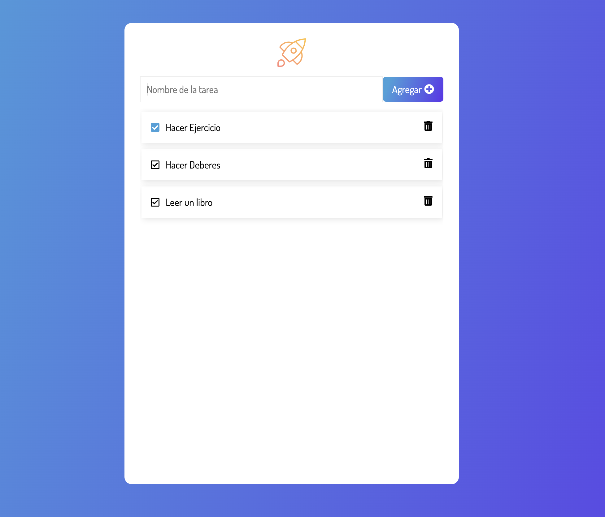

  <svg width="84" height="84" viewBox="0 0 24 24" fill="none" xmlns="http://www.w3.org/2000/svg">
    <path d="M16 9H19L14 16M10 9H14L12 17M5 9H8L10 16M15 4H17L19 7H16M11 4H13L14 7H10M7 4H9L8 7H5M6 2L2 8L12 22L22 8L18 2H6Z" fill="#9747FF"/>
  </svg>

  <h1>Proyect To-do List</h1>
  
<em>This project is a Alura's Class</em>

 

## About the Project 
 

 
 
This project was done to help me get started with my basic knowledge in JavaScript to aplicated in a project in the DOM (Document Object Model). 
 
 

## Characteristics 👷🏼‍♂️

The characteristics to deploit this page are the followings:
 

* Hability to Add New task.
* Hability to Elimined the task previously add.
* Hability to Selection the task

 
 

## Built 👷🏼‍♂️

The technologies and tools used to develop this website are: 
 

* Tools:
    * VScode
    * Chrome
    * Git

 

* Languages:
    * HTML
    * CSS
    * Javascript

## Inspiration 🔗

As I said this page is developed in the class of DOM by the Alura as base of the project to learn this characteristics.

 

### This Challeges:
* 🔗 Link: https://achipre.github.io/todo-list-basic
* 📦 Repository: https://github.com/achipre/todo-list-basic

 
 

## Other Challeges:

### 1) Landing Page: Frontendmentor's challenge

* 🔗 Link: https://achipre.github.io/landing-page-basic
* 📦 Repository: https://github.com/achipre/landing-page-basic
* 💎 FrontendMentor: https://www.frontendmentor.io/challenges/skilled-elearning-landing-page-S1ObDrZ8q
### 2) Product Card: Frontendmentor's challenge
* 🔗 Link: https://achipre.github.io/product-preview-basic
* 📦 Repository: https://github.com/achipre/product-preview-basic
* 💎 FrontendMentor: https://www.frontendmentor.io/challenges/product-preview-card-component-GO7UmttRfa

### 3) Results Summary: Frontendmentor's challenge
* 🔗 Link: https://achipre.github.io/results-summary-component
* 📦 Repository: https://github.com/achipre/results-summary-component
* 💎 FrontendMentor: https://www.frontendmentor.io/challenges/results-summary-component-CE_K6s0maV

### 4) Page to Encrypt: Alura's challenge
* 🔗 Link: https://achipre.github.io/encriptaydesencripta
* 📦 Repository: https://github.com/achipre/encriptaydesencripta
